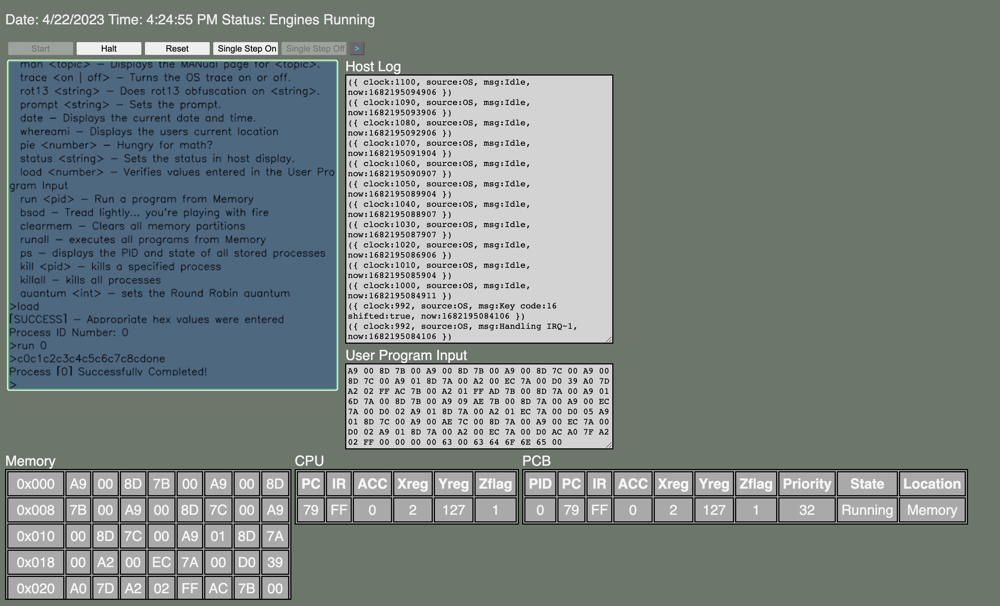

## crOS - Operating Systems

Tech:

- TypeScript
- Bash Script
- HTML & CSS

###

Project:

Browser-based virtual operating system

Instructions:

1. Install node with Homebrew: `brew install node`
2. Install TypeScript: `npm install -g typescript`
3. Create dist directory: `./c`
4. Run application: open `index.html` in a browser

###

